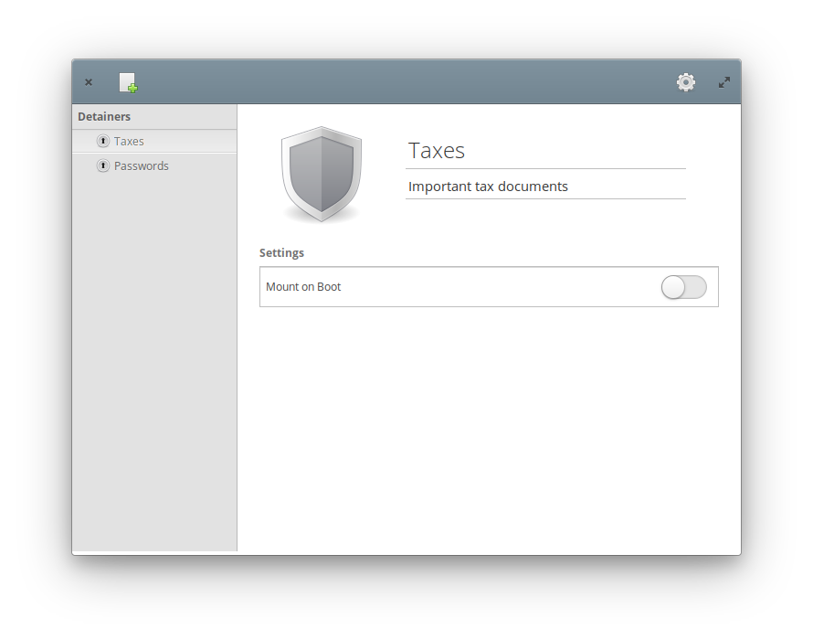

# Detainer
### (noun) - to hold or to keep in or as if in custody



Detainers is a parallel to plasma vault designed with elementaryOS in mind.

* Uses `gocryptfs` as a backend

## Installation

/* TODO: Release (: */

### Dependencies

 - `valac`
 - `gtk+-3.0`
 - `granite`
 - `meson`
 - `fuse`
 - `gocryptfs`

### Building
```
meson build
cd build
meson configure -Dprefix=/usr
ninja
```
